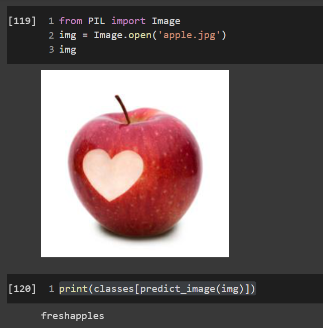
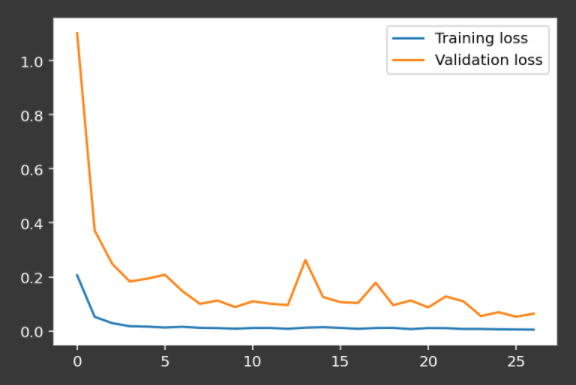
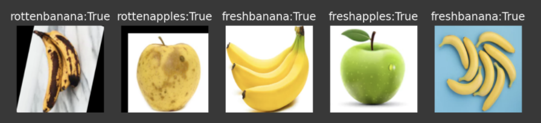

# Food Rescue
### 🍎🍊🍌🍎🍊🍌🍎🍊🍌🍎🍊🍌🍎🍊🍌🍎🍊🍌🍎🍊🍌🍎🍊🍌🍎🍊🍌
Food Condition Detector using a PyTorch model, built on a Streamlit web app 

## Google Colab Notebook

## Images

### Classifying a Fresh Apple

### Epoch - Loss Plot

### Performing Inference on 5 random test images

## Video Submission
